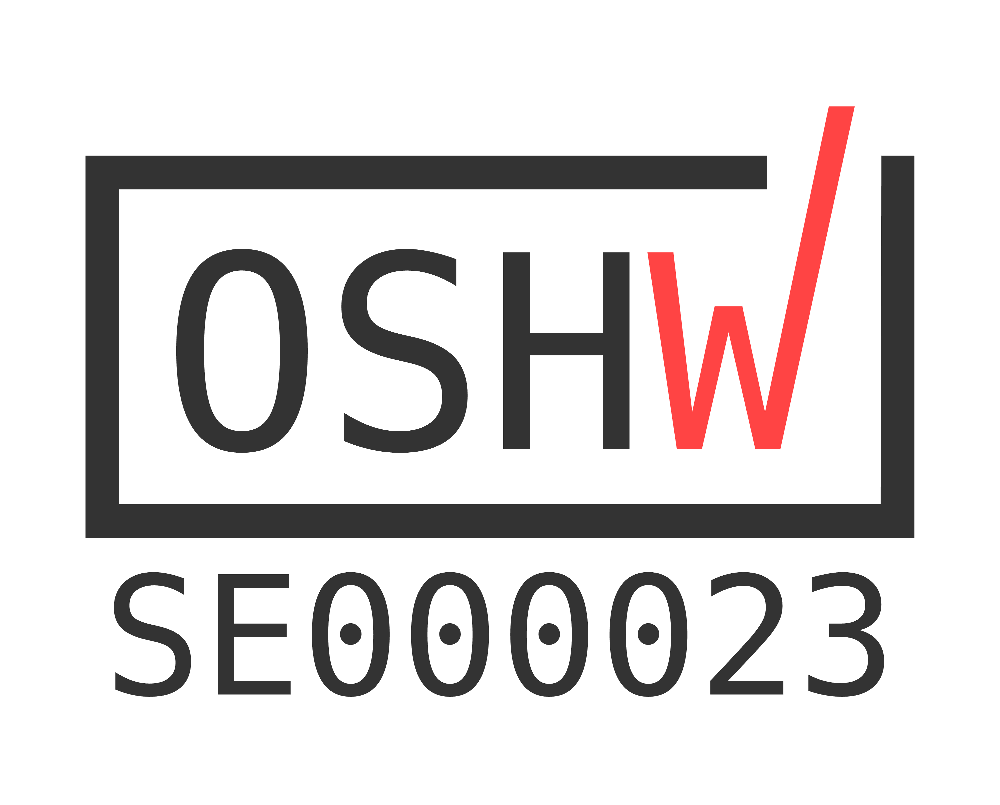

# OpenDosimeter <a href="https://certification.oshwa.org/se000023"></a>

Our open-source hardware and software dosimeter offers an afordable solution for real-time, self-monitored X-ray radiation exposure. With a total component cost of roughly $90, this device provides an accessible option for radiation monitoring to promote broad access to radiation safety. This project is a derivative of the [Open Gamma Detector](https://github.com/OpenGammaProject/Open-Gamma-Detector), with the main new feature being the effective dose calculations (in Sieverts) converted from the detected X-ray spectrum.


<br>
      <blockquote>
        <strong>SAFETY DISCLAIMER:</strong> This is a research project; builders and users assume full responsibility for verifying the accuracy and reliability of measurements obtained from the dosimeters they build. Always follow proper radiation safety protocols and consult with qualified professionals when dealing with radiation exposure.
      </blockquote>
<br clear="both">

<br>

**As of September 16, 2024**, we have published a technical paper of the OpenDosimeter on arXiv:

<blockquote>
      
N. Ger, A. Ku, J. Lopez, N. R. Bennett, J. Wang, G. Ateka, E. Anyenda, M. Rosezky, A. S. Wang, & K. Shaker, [*"OpenDosimeter: Open Hardware Personal X-ray Dosimeter"*](https://arxiv.org/abs/2409.09993) arXiv:2409.09993 (2024) 
</blockquote>

Please cite the paper above if you want to reference the OpenDosimeter project.

## Key Features 


- **Open Design:** Hardware and software designs are fully open-source, enabling reproducibility and customization
- **Affordable:** Total cost ~$90, see [here](https://github.com/OpenDosimeter/OpenDosimeter/tree/main/hardware#table-of-materials) and cost breakdown →
- **Compact:** 73 mm x 42 mm x 23 mm (with the case)
- **Programmable:** Drag and drop firmware files
- **Battery powered:** Current version has a capacity of up to 20 hours per full charge (<70 mA @ at 3.7V, 1200 mAh battery)
- **Accuracy:** Currently reliable between around **0.1 µSv/h to 1 mSv/h** (±25% accuracy) in the [photon counting](https://github.com/OpenDosimeter/OpenDosimeter/blob/main/README.md#working-principle) range (technical paper showing this coming soon on arXiv)
- **Buzzer:** Built in buzzer allows for optional audible warnings when dose rate exceeds predefined limit (default set to 5 µSv/h)
- **Calibratable:** Using Am-241 from any household ionization smoke detector for spectral/dose calibration
- **Real-time:** Direct feedback on radiation exposure, compared to passive dosimeters (e.g., OSL or TLD badges) requiring external readout
- **Logging:** The last 10 hours of dose values are stored on the device; extracted through USB connection and our web interface [here](https://opendosimeter.org/#dataLog)
<br clear="right">

## How to Make One 
**This repository has everything you need to create your own OpenDosimeter:** 

**[Case](https://github.com/OpenDosimeter/OpenDosimeter/tree/main/case):** Use this directory to 3D print the case. It contains two sets of ``.stl`` files that can be downloaded to print top and bottom components for a case with and without a belt clip. 

**[Docs](https://github.com/OpenDosimeter/OpenDosimeter/tree/main/docs):** This is where you can find the reference images used throughout this repository. 

**[Software](https://github.com/OpenDosimeter/OpenDosimeter/tree/main/software):** The software directory has everything you need to program your device, whether you are just looking to download the software with default settings or looking to modify the firmware and make changes to the sketch.  After programming your device, you will be guided through local calibration of your device and an overview of how to use it. 

**[Hardware](https://github.com/OpenDosimeter/OpenDosimeter/tree/main/hardware):** Check out the hardware directory to see the OpenDosimeter board layout in EasyEDA and instructions for ordering it using JLCPCB. This directory contains a breakdown of each component required to assemble the hardware with prices and links to order parts. Furthermore, this is where you can find instructions to assemble your device. 
Additionally, if you prefer to order directly from the PCB manufacturer, you can download the gerber file also located in the ``hardware`` directory. 


**[@OpenDosimeter](https://www.youtube.com/channel/UCCUE-LeyRK8Y6H67ti1gdNA):** Finally, head over to our YouTube channel for instructional manuals on ordering the PCB, assembling, programming, and calibrating the device.

## Working Principle 


The flow chart below illustrates the operation, using grey boxes to represent hardware components and orange boxes to indicate software functionality (inspired by the [Open Gamma Detector flowchart](https://github.com/OpenGammaProject/Open-Gamma-Detector/tree/main?tab=readme-ov-file#working-principle), demonstrating the similarity of the underlying design)

The current software (``V.1.0``) converts X-ray photons to dose using a ***photon-counting*** principle (suitable for low to medium dose rates) 

An ***energy-integrating*** parallel component (suitable for medium to high dose rates) is under development for an upcoming software upgrade (``V.1.1``)

<br clear="right">

## Troubleshooting and FAQ
Refer to [REFERENCE.md](https://github.com/OpenDosimeter/OpenDosimeter/blob/main/REFERENCE.md) for troubleshooting support and guidance in debugging

## Future Improvements
1. The current power switch on the OpenDosimeter board is fragile and sometimes breaks. Future iterations of the hardware should replace for a more durable model
2. The power consumption of the current version is quite high (up to 70 mA @ 3.7 V), as it hasn't been optimized for power efficiency. Future hardware and software improvements should be able to improve the power efficiency by atleast 2x (i.e., up to 40 hours battery life with a 1200 mAh capacity LiPo).
3. In order to make an even more integrated and compact design, the RP2040 chip from the Raspberry Pi Pico could be incorporated into the OpenDosimeter board 

## Project Team
Many people have contributed to the realization of this project so far:
- Kian Shaker (Stanford University) **[Project lead]**
- Alice Ku (Stanford University)
- Jasmyn Lopez (Stanford University)
- Enoch Anyenda (University of Nairobi)
- Norah Ger (Mama Lucy Kibaki Hospital, Nairobi)
- Grace Ateka (Kenya Bureau of Standards)
- Jia Wang (Stanford University)
- Robert Bennett (Stanford University)
- Adam Wang (Stanford University)
- Matthias Rosezky (https://nuclearphoenix.xyz/)

## Contributing
The OpenDosimeter is a living project and we invite people to contribute to future development!

Want to contribute as a developer? Reach out to Kian Shaker (kians@stanford.edu / opendosimeter@gmail.com)

### Submitting Issues and Suggestions

If you encounter any problems, have questions, or want to suggest improvements:

1. Go to our [Issues page](https://github.com/OpenDosimeter/OpenDosimeter/issues).
2. Click on "New Issue".
4. Provide as much detail as possible about your issue or suggestion.

*Note:* You'll need a GitHub account to submit issues. Another option to leave feedback is to contact us through opendosimeter@gmail.com.

## License

The OpenDosimeter project is released under the GNU General Public License v3.0 (GPL3). This means you're free to use, modify, and distribute the project for any purpose, including commercial applications. However, if you distribute software based on OpenDosimeter, you must make your source code available under the same GPL3 license. This ensures that improvements remain accessible to the community. We encourage innovation and commercial development, as we believe this can lead to wider adoption and further enhancements in radiation safety technology. For the full license text, see the [LICENSE](https://github.com/OpenDosimeter/OpenDosimeter/tree/main?tab=GPL-3.0-1-ov-file) tab in our repository.

## Citation

If your project references OpenDosimeter, or if you use it as a basis for your next cool project, please cite the paper on ArXiv:
<blockquote>
N. Ger, A. Ku, J. Lopez, N. R. Bennett, J. Wang, G. Ateka, E. Anyenda, M. Rosezky, A. S. Wang, & K. Shaker, "[OpenDosimeter: Open Hardware Personal X-ray Dosimeter](https://arxiv.org/abs/2409.09993)" arXiv:2409.09993 (2024)
</blockquote>

Or directly use the BibTex entry below:

```bibtex
@misc{OpenDosimeter,
      title={OpenDosimeter: Open Hardware Personal X-ray Dosimeter}, 
      author={Norah Ger and Alice Ku and Jasmyn Lopez and N. Robert Bennett and Jia Wang and Grace Ateka and Enoch Anyenda and Matthias Rosezky and Adam S. Wang and Kian Shaker},
      year={2024},
      eprint={2409.09993},
      archivePrefix={arXiv},
      primaryClass={physics.ins-det},
      url={https://arxiv.org/abs/2409.09993}, 
}
```

## Acknowledgements
_Inspiration:_ The basis for our hardware and software is the fantastic [Open Gamma Detector](https://github.com/OpenGammaProject/Open-Gamma-Detector/tree/main) project, check it out! Much of its detailed documentation is relevant to the OpenDosimeter as well (SiPM behavior, X-ray counting concept etc.)

_Funding support:_ King Center on Global Development at Stanford University, Knut and Alice Wallenberg Foundation (PI: Kian Shaker)
